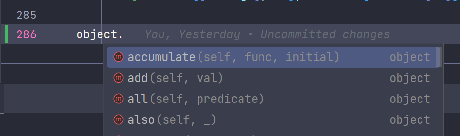
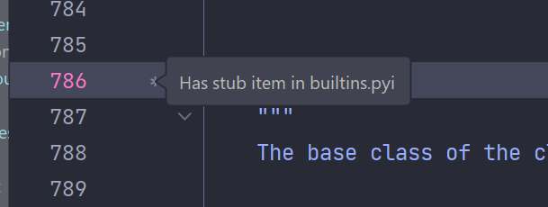

# forbiddenfp

## Summary

Functional-Programming (FP) in a forbidden way:

You can turn arbitrary function into postfix notation in favor of function chaining.

And the library provides many useful patches for builtin/itertools functions.

## Install

Compatible with Python 3.7+

```shell
pip install forbiddenfp
```

## Examples

```python
# objects are already patched at import time
import forbiddenfp

"abc".print().len()  # print out "abc", then return 3
"abc".then(lambda s: s * 2).filter(lambda s: s == "b").join()  # "bb"

# A more complex one (examples/word_count.py)
("./lorem_ipsum.txt"
 .with_open(lambda path, f: f.read().also(print(f"Reading {path}")))
 .then(lambda s: s.split(" "))
 .counter()
 .print())

```

See more `./examples`.

## `_unpack`

For every higher-order-function chained, we provide an `_unpack` version as well.
e.g. `[(1, 2), (3, 4)].sum(lambda x: x[0] * x[1])`
can also be called as `[(1, 2), (3, 4)].sum_unpack(lambda x, y: x * y)`

## Why Functional Programming

Separate out control structs (which are functions provided by library) from business logic (which are lambda functions
supplied to fill the control structs).

So we can have a clearer scope, and separate concerns, when we want to change on either side of things.

- `if ...` and `if ... else ...` are modeled by Maybe/Either monads.
- `while ...` and `for ... in ...` are generator/iterators. Additionally, stop-early behavior is `takewhile` of the
  sequence.

Philosophically, think more in `def transform(old_state) -> new_state`, rather than `state = modify(state)`.

## What About Auto-completion?

This library is almost an embedded Domain Specific Language (DSL) in Python.

It is understandable that users aren't familiar with what is available without auto-completion features in IDEs.

So we leverage the stub file to provide type hints for the builtin `object` type, which IntelliJ/PyCharm/VsCode all support.



In order to find where to stub, open your IDE and Python project/file, type `object` to get a class, CTRL/CMD + Click and use
"Find Definition" feature to get to the stub file of your IDE plugin.

Then copy/paste `src/forbiddenfp/__init__.py` under `class object` stub.

Note that for IntelliJ/Pycharm, once you CTRL + Click on `object`, you would need to click on the little icon below
to get to the *actual* stub file. Append content there.



## Warning

This library patches builtin `object` (and hence ALL classes),
with hacks around CPython API (provided by [forbiddenfruit](https://github.com/clarete/forbiddenfruit)),

so consider this NSFW (Not Safe For Work).

## Known Issues

`None` doesn't work well with chained keyword arguments.

```python
import forbiddenfp

None.apply(print)  # works
None.apply(func=print)  # doesn't work
```
